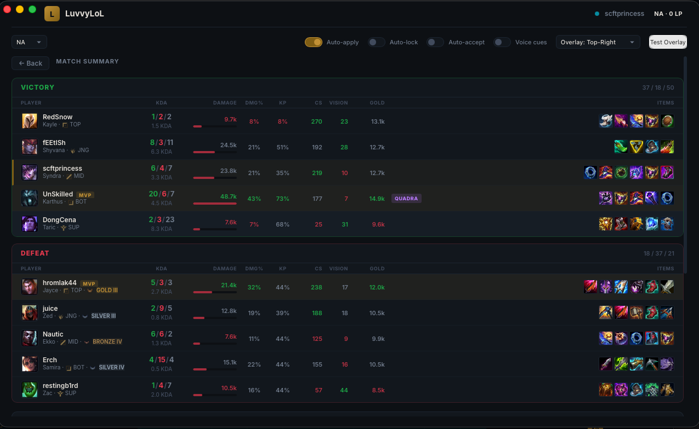
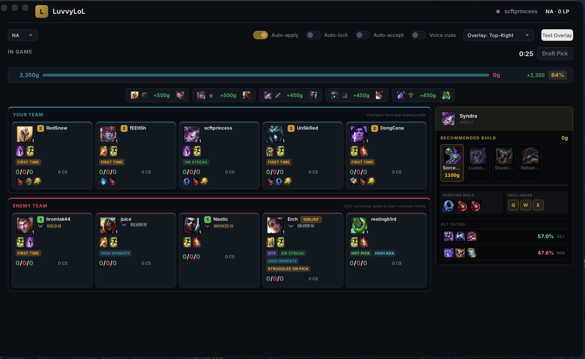
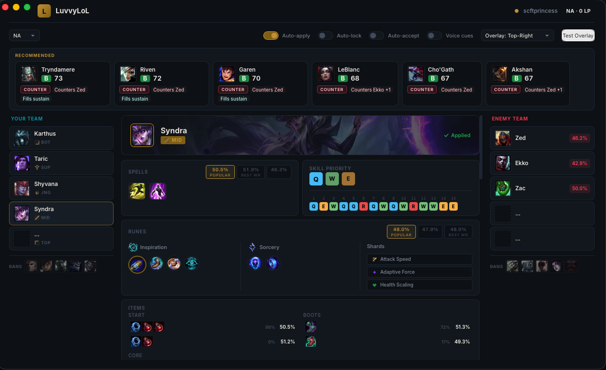
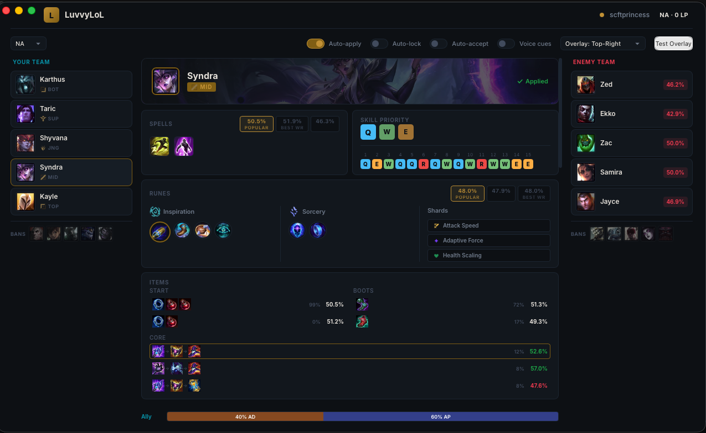
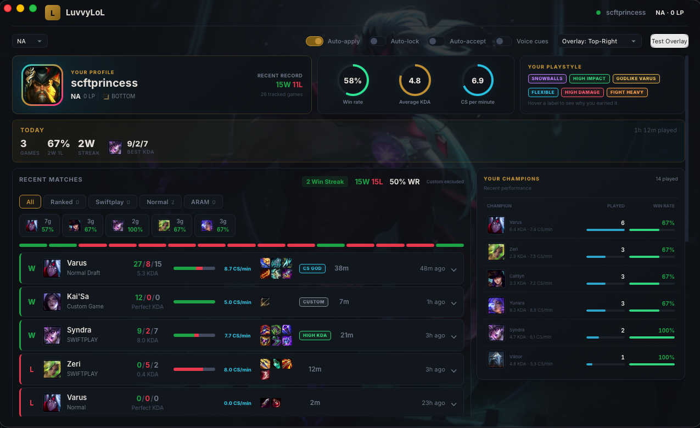
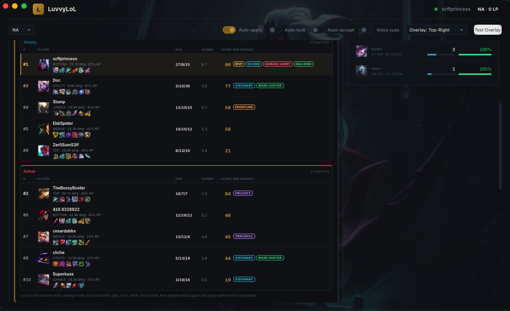

# LuvvyLoL

LuvvyLoL is a League of Legends desktop companion built with macOS in mind. It connects to the running League client and keeps champion select, live game information, builds, and match history in one place.

## What it does

- Recommends champions based on the enemy team and your recent picks
- Shows runes, summoner spells, skill order, starting items, boots, and full item paths
- Can automatically apply runes, spells, and item sets, including Swiftplay loadouts
- Shows both teams during a match with ranks, recent form, builds, lane gold differences, and useful player labels
- Provides an in-game Tab overlay with live CS per minute and build information
- Tracks recent matches, champion performance, win rate, KDA, playstyle labels, and post-game rankings

## Screenshots

### Match summary

The post-game report compares both teams with KDA, damage, kill participation, CS, vision, gold, completed items, and standout badges.

  

### Live game dashboard

The in-game view shows both teams, player form, ranks, current items, lane gold differences, and a recommended build for your champion.

  

### Champion select recommendations

During champion select, LuvvyLoL suggests picks based on the visible enemy team while preparing the selected champion's setup.

  

### Complete champion setup

The detailed build screen includes spells, runes, shards, skill order, starting items, boots, core item paths, win rates, and team damage balance.

  

### Personal profile

The profile page summarizes recent results, win rate, average KDA, CS per minute, playstyle labels, favorite champions, and match history filters.

  

### Performance rankings

Expanding a match ranks all ten players and adds labels such as MVP, CS GOD, DAMAGE CARRY, KDA KING, VISIONARY, and UNLUCKY.

  

## Installation

Download the latest macOS DMG from the GitHub Releases page, open it, and drag LuvvyLoL into Applications. Current macOS builds are made for Apple Silicon.

LuvvyLoL is not affiliated with or endorsed by Riot Games.
