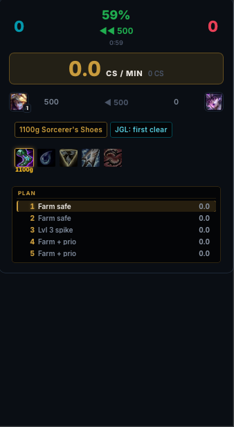

# LuvvyLoL

LuvvyLoL is a League of Legends companion built for macOS. Its main feature is a working in-game overlay that appears over League while you hold Tab, giving you useful live information without leaving the match.

It connects directly to the running League client and brings champion select, builds, live match tools, and match history together in one app.

## Working in-game Tab overlay

Hold Tab during a match to see:

* Your live CS per minute and total CS
* Team kills, game time, estimated win chance, and the current team gold difference
* Estimated gold and level differences for every lane matchup
* Your recommended item path, including items you already own
* The next item to buy, its purchase progress, and exactly how much more gold you need
* A clear recall indicator when your next item is affordable
* Situational item suggestions based on enemy damage, shielding, resistances, and other threats
* Penetration recommendations showing the estimated damage improvement
* Upcoming Dragon, Baron, Herald, and Void Grub timers
* Enemy death timers and missing-enemy warnings
* Wave advice such as when to push, freeze, roam, or farm safely
* Enemy jungler tracking and likely activity
* Vision reminders based on your role and current vision score
* Current matchup advice, upcoming level spikes, and the next few levels of your game plan

The overlay works in Draft, Ranked Solo/Duo, Ranked Flex, and Swiftplay.

## Champion select and builds

* Recommends champions based on the enemy team and your recent picks
* Shows runes, summoner spells, skill order, starting items, boots, and complete item paths
* Automatically applies supported runes, spells, and item sets
* Supports Swiftplay loadouts
* Shows both teams with ranks, recent form, builds, lane matchups, and useful player labels

## Profiles and match history

* Tracks recent matches, win rate, KDA, CS per minute, and champion performance
* Gives you personalized playstyle labels based on how you play
* Separates Swiftplay, Ranked, Normal, and ARAM matches
* Excludes custom games from your main win and loss record
* Expands completed games into full team-by-team performance rankings
* Awards labels such as MVP, CS GOD, HIGH KDA, DAMAGE CARRY, VISIONARY, and UNLUCKY

## Screenshots

### Match summary

The post-game report compares both teams with KDA, damage, kill participation, CS, vision, gold, completed items, and standout badges.

  

### Live game dashboard

The in-game view shows both teams, player form, ranks, current items, lane gold differences, and a recommended build for your champion.

  

### Champion select recommendations

During champion select, LuvvyLoL suggests picks based on the visible enemy team while preparing the selected champion's setup.

  

### Complete champion setup

The detailed build screen includes spells, runes, shards, skill order, starting items, boots, core item paths, win rates, and team damage balance.

  

### Personal profile

The profile page summarizes recent results, win rate, average KDA, CS per minute, playstyle labels, favorite champions, and match history filters.

  

### Performance rankings

Expanding a match ranks all ten players and adds labels such as MVP, CS GOD, DAMAGE CARRY, KDA KING, VISIONARY, and UNLUCKY.

  

## In Game Tab Overlay

The main feature is a working macOS overlay that appears over League while you hold Tab.

It shows your live CS per minute, estimated win chance, team and lane gold differences, recommended item path, next purchase, gold needed to recall, situational item suggestions, objective timers, enemy death timers, vision reminders, jungle tracking, wave strategy, and upcoming level power spikes.

  

## Installation

Download the latest macOS DMG from the GitHub Releases page, open it, and drag LuvvyLoL into Applications. Current macOS builds are made for Apple Silicon.

LuvvyLoL is not affiliated with or endorsed by Riot Games.
